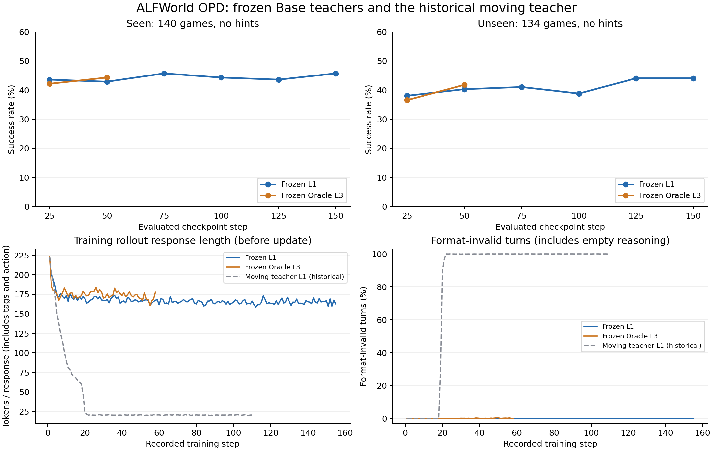

# 冻结 Base Teacher 的 L1 / Oracle L3 OPD 结果

整理日期：2026-09-17。原始日志、逐题评测结果和实际轨迹是本报告的依据。L1 完成 155/223 步后暂停；L3 原分支完成 57 步，随后从 step50 恢复，恢复分支完成 step58 后暂停。L3 的有效训练序列为父分支 1–50 + 恢复分支 51–58；父分支 51–57 另行保留，不重复合并。

**本报告的 L3 指 Oracle L3：经真实环境验证的下一步 walkthrough 动作。** 最新公共状态分层中的 L3 是 GLM 自己推荐动作，不含 Oracle，见[命名与设计对照](../../../hint_levels_20260917.md)。

## 方法和实际输入

Student 与 Teacher 均从原始 Qwen3-4B 开始。Student 全参数训练；Teacher 是独立、冻结、无 optimizer 的原始模型，参数不从 Student 同步。Student 无 hint 与环境交互；在 Student 已采样的每个 token prefix 下，Teacher 使用相同 Student prompt，加当前 hint 和简短使用说明进行评分。验证只运行无 hint 的 Student。

损失是 **forward KL：Teacher top-32 + 剩余词表合并为一个 tail bucket**。仅完整落在有效 `<reasoning>...</reasoning>` 正文内的 tokens 接受直接监督，开闭标签、`<action>` 标签与动作正文都不监督。PG 系数 0、SDL 系数 1，归一化保留 `response_token_mean`。Top-32 加 tail 是 33 类粗粒化 KL，不是只保留 top32 后重新归一化。

需要区分“冻结 Teacher 的模型输入”与“GLM 生成 hint 的输入”：

| 输入 | 历史冻结教师 L1 | 历史冻结教师 Oracle L3 |
|---|---|---|
| Student / Qwen Teacher 公共部分 | 任务、当前观察、最近 2 轮观察与动作、合法动作列表 | 同左 |
| GLM 看到的内容 | `task`、`current_observation`、最近两个动作字符串；**没有历史 observation 和动作空间** | 任务、当前观察、完整执行动作历史、当前合法动作、walkthrough、已验证的继续路径及下一参考动作 |
| GLM 的职责 | 给方向性提示 | 原样返回 `next_reference_action`，不得添加解释 |
| 缺失处理 | API 有界重试，预算内失败行零监督 | 无可验证继续路径时零监督；API 失败另计 |

上述历史 L1 输入缺口可直接在[当时 public_state 实现](input_code_snapshots/l1_online_l1.py)核对。2026-09-16 的 30 题诊断已经对齐完整公共输入；不能把新协议追溯成旧训练当时的设置。

Oracle 会先回放 Student 实际执行历史，再验证可执行的 walkthrough 后缀，选择已验证继续路径的首动作；不是把第 t turn 对应到原始 walkthrough 第 t 步。偏离后无法找到成功后缀则不监督。原始版本曾因 GLM 增添错误位置解释而停止，正式版本只允许输出已验证动作。[Oracle 对齐源码](input_code_snapshots/l3_walkthrough_oracle.py)与[在线 L3 输入](input_code_snapshots/l3_online_l3.py)为当时的快照。

## 参数

| 参数 | 实际设置 |
|---|---|
| 模型与优化 | Qwen3-4B，全参数 AdamW，lr=1e-6，BF16；Teacher 参数 offload |
| 训练集 | 3,553 个不同游戏，补齐 15 行至 3,568；计划 1 epoch / 223 steps |
| 每步采样 | 16 个游戏 × 8 条轨迹 = 128 局；8 × A100 80GB |
| 环境预算与历史 | 最多 50 动作；最近 2 轮 observation / executed action；不携带过往 reasoning |
| Prompt / response 上限 | 4096 / 1024 tokens；原生 thinking 关闭，prompt 显式要求 reasoning + action |
| 采样 | temperature=0.6，top-p=0.95，top-k=20；seed=42 |
| GLM | GLM-5.3-Flash，thinking 开启，reasoning_effort=low，API 并发 128 |
| Hint completion 上限 | L1 768；Oracle L3 1024；L3 Oracle CPU worker 32 |
| API 失败 | 最多 4 次尝试；每步失败状态不超过去重状态的 1% 或 10 个中较小者 |
| 显存预算 | actor 12,288 tokens/GPU；log-prob / Teacher 16,384 tokens/GPU |
| 评测 | 每 25 steps，Seen 140 题 / Unseen 134 题，各一条轨迹，分开统计；跳过 step0 |
| 保存 | L1 启动时每 5 步，后按要求保留已评测步；L3 只在评测步保存 |

公共配置快照：[L1](config_snapshots/l1_frozen_base_teacher_top32_20260912/train_full.yaml)、[L3](config_snapshots/l3_frozen_base_teacher_top32_20260914/train_full.yaml)。L1 公共配置的保存频率后来改为 25；不能用修改后的文件否认早期每 5 步保存的事实。快照是实验记录，运行需要相应冻结 Teacher 实现和本地资产。

## 全部完整评测点

成功率按原生环境成功计数 / 游戏数计算，每个游戏仅一条轨迹。对每个 split 逐 `traj_uid` 重建完整 episode，核对 140 / 134 个不同游戏及一致的 episode reward（成功 10，失败 0），再与训练指标日志核对。共核验 **2,192 条评测 episode**，不是将 turn 当成独立样本。

| 条件 | Step | Seen | Unseen | 同步训练批次 response_length/mean |
|---|---:|---:|---:|---:|
| Frozen L1 | 25 | 61/140 = 43.57% | 51/134 = 38.06% | 171.74 |
| Frozen L1 | 50 | 60/140 = 42.86% | 54/134 = 40.30% | 166.60 |
| Frozen L1 | 75 | 64/140 = 45.71% | 55/134 = 41.04% | 165.05 |
| Frozen L1 | 100 | 62/140 = 44.29% | 52/134 = 38.81% | 164.79 |
| Frozen L1 | 125 | 61/140 = 43.57% | 59/134 = 44.03% | 166.46 |
| Frozen L1 | 150 | 64/140 = 45.71% | 59/134 = 44.03% | 166.82 |
| Frozen Oracle L3 | 25 | 59/140 = 42.14% | 49/134 = 36.57% | 178.81 |
| Frozen Oracle L3 | 50 | 62/140 = 44.29% | 56/134 = 41.79% | 169.68 |

response_length 是该 step 更新前训练 rollout 的每响应 token 均值，包含标签和 action；评测是该 step 更新后的模型。两者既非同一批输入，也非同一个更新时点。该列不是验证集长度、不是纯 reasoning 长度，更不是整条 episode 长度。

相同 step50，L3 比 L1 多成功 2 个 Seen、2 个 Unseen 游戏（+1.43 / +1.49 个百分点）。现有单 seed 结果不足以证明两种 hint 等价或某种机制已被证实。也不能用 L1 step150 与 L3 step50 的差值评价同训练预算优劣。

## 输出长度、格式和耗时

| 指标 | Frozen L1（有效 1–155） | Frozen Oracle L3（有效 1–58） |
|---|---:|---:|
| 首批 response token 均值 | 222.89 | 222.89 |
| 最后一步均值 | 162.84 | 177.74 |
| 最后 10 步的逐步均值再平均 | 165.17 | 169.50 |
| empty reasoning rows | 0 | 0 |
| 因零监督跳过的更新步 | 0 | 0 |
| 格式异常 / 实际 turns | 175 / 710,076 = 0.0246% | 509 / 276,032 = 0.1844% |
| 平均 `timing_s/step` | 400.03 秒 | 429.36 秒 |

耗时使用原始记录的 step 总耗时均值，包含对应步的评测/保存开销；不是排除所有辅助工作的纯训练基准。原始日志同时保留 rollout、Teacher、actor update 与 hint 等待的分项时间。

L3 并非所有 turn 都能获得 Oracle。覆盖率在 step1 为 81.94%、step25 为 89.60%、step50 为 70.15%、恢复 step58 为 70.69%（按训练对齐后的行统计）。覆盖以外的行不蒸馏；历史 `hint_failed_rows` 混含 Oracle unavailable，不能全部当作 API 故障。

此前随 Student 更新的 Teacher 运行完成 110 步，其中 42 步因无有效正文监督跳过更新。冻结版本在已观察区间没有出现同样的空 reasoning，但仍明显变短。**“变短”与“空正文退化”是两个现象；冻结 Teacher 是否是唯一原因尚未由多 seed、严格对照实验确定。**

历史 Base 全量成绩 Seen 41/140、Unseen 41/134 使用 4096 response tokens；这里使用 1024。没有同协议全量 step0，不能把二者差值直接称为训练提升。新 30 题 Base 诊断是另一小样本集合，同样不能替代该缺失基线。

## 原始证据与真实轨迹

- [L1 155 步指标](l1_metrics.jsonl)、[L3 父分支 57 步指标](l3_parent_metrics.jsonl)、[L3 恢复 51–58 步](l3_resume50_metrics.jsonl)、[L3 有效分支](l3_effective_metrics.jsonl)
- [逐题验证结果](evaluation_episodes.jsonl)、[逐评测步 CSV](evaluation_metrics.csv)、[机器可读汇总](summary.json)
- [冻结教师 L1 hash 审计](l1_frozen_teacher_audit.jsonl)、[L3 父分支审计](l3_parent_frozen_teacher_audit.jsonl)
- [L1 原提示词](l1_prompt.txt)、[Oracle L3 原提示词](l3_oracle_prompt.txt)
- [L3 更新前首批训练轨迹](traces/l3_training_step_000001.md)、[step25 训练轨迹](traces/l3_training_step_000025.md)、[step50 训练轨迹](traces/l3_training_step_000050.md)：每文件两局，逐 turn 含 Student 输出、实际 hint 与 Oracle 状态。
- Step50 同题评测轨迹：[L1 Seen](traces/l1_step50_valid_seen.jsonl)、[L3 Seen](traces/l3_step50_valid_seen.jsonl)、[L1 Unseen](traces/l1_step50_valid_unseen.jsonl)、[L3 Unseen](traces/l3_step50_valid_unseen.jsonl)。每 split 固定选择 gamefile 字典序第一题，非按成功与否选择；Student 均无 hint。

L3 恢复分支还没有新的 held-out 评测，因此最后评测仍是父分支 step50。暂停和历史 GPU 状态见 `status_snapshots/`。本次不把旧状态文件当作实时运行监控，也不承诺旧 checkpoint 路径现在仍存在。
