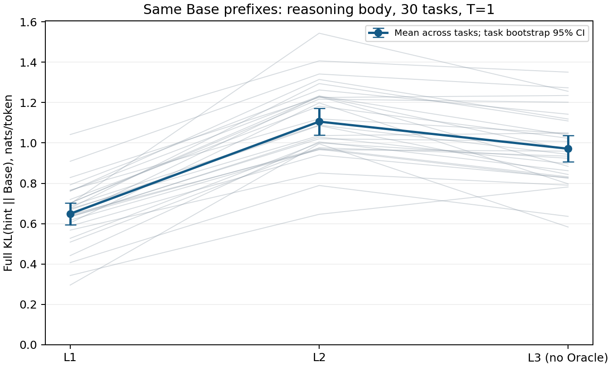
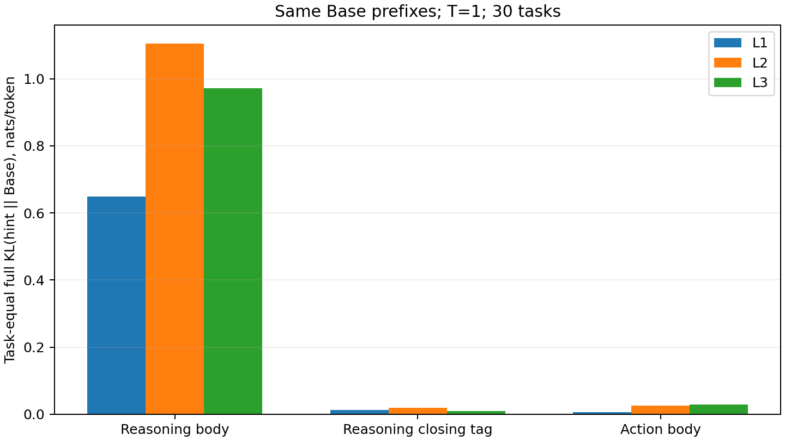

# L1–L3追加20题：独立轨迹与相同Base prefix的KL

新增20个互不重复的任务（Seen 10、Unseen 10），每题运行Base、Base+L1、Base+L2、Base+L3共80条独立轨迹。加上此前10题，累计每组30题、120条轨迹。所有分布来自同一原始Qwen3-4B基础权重；无训练或参数更新。L3沿用新定义：公开状态上的明确动作建议，不提供Oracle。

[完整轨迹浏览](viewer.html) · [全部120条JSONL](full_trajectories_30x4.jsonl.gz) · [逐turn KL](turn_kl_metrics.jsonl.gz) · [逐题KL CSV](task_kl_metrics.csv) · [参数](protocol.json) · [校验](validation.json)

**实测排序是L2 > L3 > L1，按reasoning正文完整词表forward KL计算。** 累计30题中，L2和L3各自在30/30题高于L1；L2在27/30题高于L3。这个排序在新增20题中同样成立，语义级别名称并不保证实际分布改变量单调增加。

## 计算定义

记s为无hint Base实际到达的公开环境状态，y为它实际采样的response，h_L为GLM只根据该公开状态生成的L级hint。在每个原始token prefix y_<t 上计算：

`p_t(v) = Base(v | s, y_<t)`

`q_L,t(v) = Base(v | s + h_L, y_<t)`

`forward KL = sum_v q_L,t(v) * [log q_L,t(v) - log p_t(v)]`

`reverse KL = sum_v p_t(v) * [log p_t(v) - log q_L,t(v)]`

主指标覆盖完整模型输出词表，T=1、自然对数、单位nats；不做top-k/top-p截断或Top32重归一化。另存T=0.6、Top32+tail粗粒化KL、entropy、top1概率及Top32重叠。GLM不看到当前response或其token prefix，只看与Base相同的任务、观察、最近两轮观察/动作和完整动作空间。GLM每状态给出一次hint，随后用同一个hint对该turn所有Base token位置进行教师强制前向。

覆盖30条无hint Base轨迹、992个turn、221,620个原始token位置；每个位置对比L1/L2/L3。先在每题内按reasoning token平均，再对30题等权平均。另保留按token及按turn加权的汇总，避免长失败循环主导唯一结论。

## 主结果：reasoning正文的完整词表KL

|hint|KL(hint ‖ Base)，题目等权|任务bootstrap 95% CI|KL(Base ‖ hint)|按token加权的forward KL|Top32+tail forward KL|
|---|---:|---|---:|---:|---:|
|L1|0.649295|[0.594372, 0.703323]|0.496968|0.694051|0.649290|
|L2|1.105531|[1.038542, 1.170929]|0.867207|1.128561|1.105514|
|L3|0.971287|[0.907457, 1.037392]|0.775292|1.003906|0.971274|

新增20题单独统计：

|hint|题目等权forward KL|题目等权reverse KL|
|---|---:|---:|
|L1|0.645547|0.504195|
|L2|1.097755|0.871509|
|L3|0.953332|0.771453|

同题配对差值（后一层减前一层）：

|差值|均值|任务bootstrap 95% CI|差值为正的题数|
|---|---:|---|---:|
|l2_minus_l1|0.456236|[0.414317, 0.502496]|30/30|
|l3_minus_l2|-0.134245|[-0.178389, -0.090522]|3/30|
|l3_minus_l1|0.321991|[0.287551, 0.357938]|30/30|

KL衡量输入hint造成的分布变化，不是hint正确性、帮助程度或训练收益；更大不自动代表更好。每个状态只取一个hint样本，置信区间只反映这批任务间的变化，不包含重复生成hint的方差。

本次992个Base状态上的hint平均长度为：L1 32.5词、L2 142.0词、L3 46.4词（按空白分词）。L2提供较长的局部分析，可能与reasoning分布变化更大有关，但本实验没有控制hint长度，不能单独归因于级别或措辞。

## 不同输出区域

reasoning正文和标签边界由原始token IDs的解码前缀定位；不重新编码response。跨越闭合标签边界的token归入闭合标签组。未闭合的reasoning单列，不伪装成有效正文；`valid_reasoning_body`另提供训练格式检查通过的正文统计。原始token级明细保存在`scores/tokens_*.jsonl.gz`，按`score_row_index`与`response_index`可精确还原prefix。

## 新增20题独立rollout

|条件|成功|Seen|Unseen|平均turn数|平均输出tokens|平均reasoning tokens（有效格式）|格式错误turn|
|---|---:|---:|---:|---:|---:|---:|---:|
|base|11/20|7/10|4/10|31.60|219.42|198.90|0/632|
|base_l1|13/20|7/10|6/10|26.75|149.43|128.72|1/535|
|base_l2|16/20|9/10|7/10|21.10|157.41|136.77|5/422|
|base_l3|15/20|8/10|7/10|20.60|133.50|112.28|0/412|
## 累计30题独立rollout

|条件|成功|Seen|Unseen|平均turn数|平均输出tokens|平均reasoning tokens（有效格式）|格式错误turn|
|---|---:|---:|---:|---:|---:|---:|---:|
|base|15/30|8/15|7/15|33.07|223.41|202.91|0/992|
|base_l1|20/30|9/15|11/15|24.27|151.24|130.58|1/728|
|base_l2|26/30|14/15|12/15|18.07|158.68|138.28|8/542|
|base_l3|25/30|13/15|12/15|17.13|134.16|112.96|0/514|

独立rollout的状态会分岔；上述KL完全沿无hint Base的轨迹计算，不把各hint组自身路径上的概率拿来与Base错位比较。提示词保持上一批不变，实际输出可能越过预设剂量边界或包含错误；原始hint均保留，未按质量重抽。

## 运行与复现

8卡独立推理；每题最多50轮，每response最多1024token，temperature=0.6、top_p=0.95、top_k=20，原生thinking关闭、显式reasoning。GLM-5.3-Flash生成hint，thinking开启，reasoning_effort=low。相同level、公共状态、seed和系统提示词的已有hint可复用，其余重新请求，来源逐条标记。KL前向使用eval模式及inference_mode，log_softmax和概率运算使用FP32；只分块落词表logits，避免把所有序列位置的FP32词表同时留在显存。

检查包含已知不对称分布、相同分布KL=0、极小tail稳定性；每个GPU额外核对原始模型forward与拆分hidden/lm_head的logits、同长度输入上扰动所有未来token后的因果不变性，以及FP64参考KL。独立prefix与完整序列的跨长度数值差异另作诊断记录。所有检查结果保留在validation.json。

首次打分在跨序列长度的BF16最大logit差阈值处停止，记录位于score_attempts/initial_isolated_prefix_threshold，未纳入结果。抽查同长度原生前向与拆分计算完全一致，未来token扰动也不改变当前预测；独立prefix的某个位置虽有0.5625的最大logit差，其分布KL仅约1.74e-12。正式重跑采用同长度因果校验，不再把跨长度的原始logit最大差作为对齐失败的充分条件。

## GitHub 发布范围（2026-09-17）

公开版本包含完整 120 条独立轨迹、992 个打分输入、逐 turn/逐题 KL、实际 prompts、完整浏览界面、统计图和校验记录。大 JSONL 使用 gzip 无损压缩。逐 token 指标 `scores/tokens_*.jsonl.gz`、全部 API 请求响应及失败尝试保留在本地完整证据包，未复制进 Git；见 [本地证据包校验](package_validation.json)。此处 `execution.json` 是实验完成时快照，不代表读取报告时的机器状态。

[分层设计](../../../hint_levels_20260917.md) · [同状态真实 hint 示例](hint_examples_same_state.md) · [打分输入（原始 token IDs 与 hints）](scoring_inputs.jsonl.gz) · [原始打分实现](source_snapshot/score_worker.py)

source_snapshot 保留实际使用的打分与生成代码，仅供审查；其中 /probe、/models/base 等是原容器路径。不是可直接在任意机器执行的启动器；重跑需要自行提供原模型、ALFWorld、原始运行文件和 API 配置。发布包不包含认证文件或模型权重。
