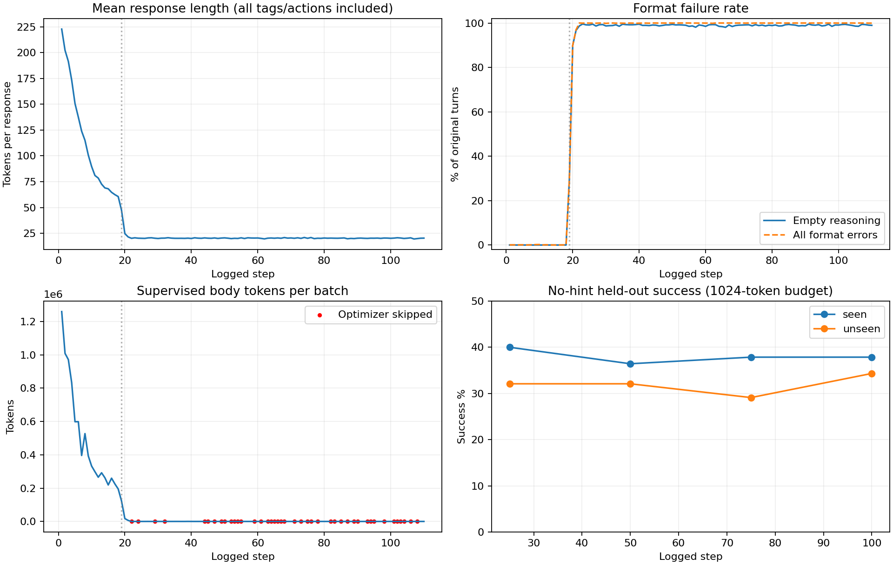

# ALFWorld Hint Ladder 实验报告：在线 L1、reasoning 正文蒸馏与格式退化

更新：2026-09-12，UTC+08:00。主实验：`l1_reasoning_body_top32_20260911`。本文汇总运行设置、完整已完成阶段、评测、耗时、真实轨迹和后续分布诊断；较早实验按各自协议列出，不混为同一个对照。

**本轮计划使用全量 3,553 道训练题运行 223 步，实际完成 110 步后按用户要求暂停，没有跑完整个 epoch。reasoning 在前 18 步逐渐缩短，第 19 步出现大规模空正文，第 22 步首次整批没有可监督 token。暂停前共有 42 个记录步跳过 optimizer。** 此后按要求删除所有 OPD checkpoints 和批量原始轨迹，留下指标、配置及精选诊断证据。本文发布不包含重启实验。

最近一次完整评测是 **step100：Seen 53/140 = 37.86%，Unseen 46/134 = 34.33%**。未评测 step110。格式退化与任务成功率是两个指标：模型仍可能输出可执行的正确动作，但我们要蒸馏的 reasoning 正文几乎消失了。缺少本轮相同 1024-token 预算的 step0 对照，不能把历史 base 与本轮评测的差直接归因为训练收益。

## 1. 阅读入口与证据层级

| 内容 | 文件 |
|---|---|
| 8 局完整可读轨迹，293 turns | [真实轨迹索引](docs/hintladder/experiments/l1_reasoning_body_top32_20260911/report_20260912/真实轨迹.md) |
| 训练中的空 reasoning / 嵌套标签原始 turn | [关键 turn 原文](docs/hintladder/experiments/l1_reasoning_body_top32_20260911/report_20260912/关键turn原文.md) |
| 全部 110 步原始数值日志 | [metrics.jsonl](exports/key_error_traces_20260912/metrics.jsonl) |
| 可画图的逐步表、汇总和生成脚本 | [CSV](docs/hintladder/experiments/l1_reasoning_body_top32_20260911/report_20260912/training_timeline.csv)、[summary.json](docs/hintladder/experiments/l1_reasoning_body_top32_20260911/report_20260912/summary.json)、[build_evidence.py](docs/hintladder/experiments/l1_reasoning_body_top32_20260911/report_20260912/build_evidence.py) |
| 10 局原始保留轨迹，393 turns；40 条关键错误 | [保留包](exports/key_error_traces_20260912/README.md) |
| base 的 412 turns / 87,246 正文位置分布 | [top-32 诊断](exports/key_error_traces_20260912/top32_overlap/REPORT.md) |
| 单条完整 turn、每个 prefix 两侧 top-10 | [105 个位置完整列表](exports/turn7_prefix_top10_20260912/完整turn_逐prefix_top10.md)、[JSONL](exports/turn7_prefix_top10_20260912/prefix_top10.jsonl)、[完整输入](exports/turn7_prefix_top10_20260912/turn.json) |
| 公开训练配置、启动来源及 mask 验证 | [配置](configs/experiments/l1_reasoning_body_top32_20260911/train_full.yaml)、[启动清单](docs/hintladder/experiments/l1_reasoning_body_top32_20260911/launch_manifest.json)、[412 条 token 审计](docs/hintladder/experiments/l1_reasoning_body_20260911/mask_audit.json) |

W&B：[alfworld-l1-reasoning-body / base-l1-reasoning-body-top32-20260911](https://wandb.ai/2606478269-ustc/alfworld-l1-reasoning-body/runs/base-l1-reasoning-body-top32-20260911)。本地日志可独立核对，不依赖 W&B 页面是否可访问。

本文中的“base”是未经我们这轮 OPD 更新的原始 **Qwen3-4B** 权重，不是另一个叫 Qwen3-4B-Base 的模型。分布诊断用 base，训练曲线来自本轮在线更新；两者不能互称。

## 2. 实验问题与历史脉络

核心问题是：在同一学生已生成的前缀下，给教师一条额外 hint，再让无 hint 学生靠近教师分布，是否能改善 ALFWorld 决策？最新一轮进一步限制：只监督 `<reasoning>` 内部，避免直接蒸馏 reasoning 标签和 action。

| 阶段 | 实际完成情况 | 结论边界 |
|---|---|---|
| 离线任务级 L3，1,500 题，action-only | 恢复分支完成 151 步，第 152 步异常退出；step150 Seen 1.37%、Unseen 0.20% | [历史报告](docs/hintladder/experiments/l3_train1500_20260908/report_20260909/REPORT.md)显示退步；固定 128/128 题、每题 4 次，与当前协议不同 |
| base 显式 reasoning 完整评测 | Seen 41/140=29.29%；Unseen 41/134=30.60% | [完整结果](docs/hintladder/experiments/reasoning_eval_20260910/README.md)使用每题一次、50 turns、4096-token 输出预算 |
| fast 在线 L1，监督全部普通响应 token | 完成 5 步验收；step5 Seen 52/140=37.14%、Unseen 57/134=42.54% | [验收报告](docs/hintladder/experiments/fast_verify_20260910/REPORT.md)；使用 1024-token 预算，缺少同协议 step0 |
| 后续全部响应 token 的全量训练 | 发生较早的格式退化，过滤错误后仍继续产生大量无效输出 | [早期格式审计](exports/key_error_traces_20260912/earlier_format_failure/报告与原始轨迹.md)；与本轮的 step19/22 不是同一条时间线 |
| 仅 reasoning 正文、top-20 | 首个完整训练 step 前按要求暂停 | [记录](docs/hintladder/experiments/l1_reasoning_body_20260911/README.md)；没有完成更新结果，不构成 top-20 vs top-32 对照 |
| **仅 reasoning 正文、top-32 + tail** | **本报告：110/223 步；step19 大量空正文，42 步跳过更新** | 这是一次未完成且发生训练目标退化的运行，不是方法有效性的完成证据 |

Hinter 的 reward 设计和 Hinter 参数训练没有在本轮实施。GLM 作为固定外部 hint 生成服务；我们训练的是 Qwen 学生。

## 3. 数据、交互历史与成功标准

训练清单包含 3,553 个不同 ALFWorld 官方 train 游戏。为使 16 题的 batch 整除，末批补入 15 条重复项，共 3,568 行，计划一个 epoch、223 个 batch。配置“全量”描述所选数据范围，**不表示暂停时已经完成全量训练**。固定清单在 [data/game_lists](data/game_lists)。

Seen 为 140 个游戏，Unseen 为 134 个游戏，分开报告。当前实验每题独立运行一次，最多 50 个动作 turn。任务包括找物并放置、在灯下检查、清洗、加热、冷却、寻找两个同类物品。具体动作是否合法由环境提供的 admissible actions 和执行结果判断，成功由环境的任务完成状态判定，不用 GLM 当 judge。

每个 turn 都重新构造输入，但**并非没有历史**：输入含任务、最近两轮的原始 observation 与 executed action、当前 observation、当前 admissible actions。历史格式是：

```text
[Observation k: '{observation}', Action k: '{executed_action}']
```

`history_length=2`，`accumulate_chat_history=false`。之前 assistant 写的 reasoning 不作为完整对话继续拼接；较早观察也不会全部保留。实现见 [memory.py](agent_system/memory/memory.py) 与 [env_manager.py](agent_system/environments/env_manager.py)。完整导出 trace 保存很多 turn，是供分析使用；它不等于模型某一时刻看见了整局。

任务成功率按 episode 计算：成功局数 / 评测游戏数。格式错误率按 turn 计算：格式错误 turn 数 / 原始 rollout turn 数。一个任务可能有多个错误 turn，也可能格式不合格但动作仍可执行。不能把这两个分母混用。

## 4. 三个角色、真实 prompt 与生成顺序

### 4.1 Student：无 hint 的原始交互输入

Qwen3 原生 `enable_thinking=false`，显式要求 `<reasoning>` 和 `<action>`。原始模板如下，来自 [alfworld.py](agent_system/environments/prompts/alfworld.py)：

```text
You are an expert agent operating in the ALFRED Embodied Environment. Your task is to: {task_description} Prior to this step, you have already taken {step_count} step(s). Below are the most recent {history_length} observations and the corresponding actions you took: {action_history} You are now at step {current_step} and your current observation is: {current_observation} Your admissible actions of the current situation are: [{admissible_actions}].  Now it's your turn to take an action. You should first reason step-by-step about the current situation. This reasoning process MUST be enclosed within <reasoning> </reasoning> tags. Once you've finished your reasoning, you should choose an admissible action for current step and present it within <action> </action> tags.
```

该模板经 tokenizer 的 chat template 渲染。原生关闭 thinking 时模板中的空 think 前缀和后续显式 reasoning 是两个概念；两侧沿用相同 chat template。真实渲染文本可看 [student_prompt.txt](exports/turn7_prefix_top10_20260912/student_prompt.txt)。

### 4.2 GLM：实时生成无 oracle 的 L1

实际模型 ID 为 **`glm-5.3-flash`**；本轮 **thinking 开启**，`reasoning_effort=low`，不是关闭 thinking 的实验。系统 prompt 原文来自 [l1_prompt.txt](configs/experiments/l1_online_full_20260910/l1_prompt.txt)：

```text
你在帮助另一个智能体完成任务。根据它的任务、当前观察和历史动作，给一个轻量的提示，帮助它结合当前进展想清楚眼前的问题。还在寻找物品时，可以引导它联想物品用途和常见摆放规律；所需物品已经出现时，提醒它围绕眼前资源和任务目标继续思考。把具体地点和具体操作留给它自己推断，不在提示中点名目的地或描述要执行的动作。只输出一两句简短的英文提示。
```

user 消息是 JSON，只有 `task`、`current_observation`、`action_history`（最近两个已执行动作）。不传 oracle walkthrough、隐藏物体位置、历史 observation、Student 当前 response，也不传单独的 admissible-action 列表。GLM 仍可能从当前 observation 中看见物体和位置，这属于公开状态。

每个 turn 的公开状态出现后即异步提交；相同状态在该训练步内去重。请求与 Student 后续 rollout 并行，在 Teacher forward 前收齐。**不是预先给 3,553 道题各生成一条固定 hint**，也不是让 GLM 看完整学生答案再点评。

Prompt 表达的是目标风格，程序检查不保证语义满足。保留的真实 hint 中有点名 fridge、desk 等位置的例子，也有不准确的常识描述；不能仅凭模型名或格式校验认定全部 L1 都符合“低信息、无具体地点”的设计。

### 4.3 Teacher：当前 Qwen 权重，只比 Student 多一段便签

在任务与历史交界处插入以下文本，其余输入保持一致：

```text
<private_teacher_note>
{current_L1_hint}
</private_teacher_note>
Use this hint as optional guidance for your reasoning; check it against the current observation and admissible actions. Keep the required response format and do not mention the hint.
```

实现为 [teacher_prompt.py](hintladder/teacher_prompt.py)。移除便签与使用说明后必须逐字恢复 Student prompt。Teacher 复用**当前正在训练的 Qwen 权重**，在原始 Student response token prefix 上计算 next-token 分布，并停止教师分布的梯度。下一批再用更新后的当前权重评分，教师不是独立冻结的外部强模型。

训练时不让 Teacher 自己生成另一段回答：先有无 hint Student rollout，再对相同响应前缀分别评分。报告的 base“直接带 hint 推理”轨迹则是另一个诊断实验，应与这一训练流程区分。

## 5. 实际优化目标与 mask

令同一学生前缀下，无 hint 学生分布为 $p_t(v)$，有 hint 教师分布为 $q_t(v)$。完整 forward KL 为：

$$D_{\mathrm{KL}}(q_t\Vert p_t)=\sum_{v\in V}q_t(v)\log\frac{q_t(v)}{p_t(v)}.$$

本轮计算教师 top-32 与一个 tail 桶：

$$S_t=\operatorname{Top32}(q_t),\qquad q_{t,R}=1-\sum_{v\in S_t}q_t(v),\qquad p_{t,R}=1-\sum_{v\in S_t}p_t(v),$$

$$\ell_t=\sum_{v\in S_t}q_t(v)\log\frac{q_t(v)}{p_t(v)}+q_{t,R}\log\frac{q_{t,R}}{p_{t,R}}.$$

评分使用温度0.6后的全词表分布，采样的top-k/top-p过滤不进入KL归一化。这里不取两侧 top-32 的交集，也不把 32 个概率重新归一化到 1。尾部使用整个词表剩余质量；实现有 FP32 归约、tail clamp 和 log 的数值下限。单个 $q\log(q/p)$ 项可以为负，完整 KL 理论上非负；约 $10^{-6}$ 量级的负数可能来自浮点误差。

直接监督范围：

```text
<reasoning>      reasoning 正文      </reasoning>   <action>动作</action>
   mask=0             mask=1             mask=0            mask=0
```

边界依据原始 sampled token IDs 的前缀解码，排除跨正文/标签边界的整个 BPE token，避免重新分词导致位置错配。正文内部空白可选中；特殊 token、标签、action、标签外文本不直接监督。格式不合格、正文为空、或预算内 hint 失败的行零监督。

`response_token_mean` 沿用原始 response mask 的分母：

$$\mathcal L_{\mathrm{SDL}}=\frac{\sum_t m_t\ell_t}{N_{\mathrm{response}}}.$$

这是 mask 与归一化契约；分布诊断中的“正文逐位置 KL 均值”不等于日志中的 batch loss。实际微批次加权见 [dp_actor.py](verl/workers/actor/dp_actor.py) 与 [skillsd_utils.py](verl/trainer/ppo/skillsd_utils.py)。PG 系数为 0、SDL 系数为 1、entropy 系数为 0、reference KL 关闭，没有单独的格式奖励。虽然日志仍记录部分 PPO 项，它们不代表 PG 项参与了本轮总目标。

mask 限制的是**预测位置**，不是候选词表。在被监督的正文位置，候选 token 仍可能是句号、换行、标签开头等。共享参数更新也会间接改变未监督位置的行为。因此“没有直接监督闭合标签/action”不等于“格式一定不变”。整批没有监督且 PG=0 时，代码连 optimizer 与其状态更新也跳过，不以零梯度继续执行 AdamW。

## 6. 全部关键运行参数

| 项目 | 本轮实际值 |
|---|---|
| 初始化 / 恢复 | 原始 Qwen3-4B，从头开始本轮；不恢复旧训练 checkpoint |
| 硬件 | 8 × A100-SXM4-80GB；FSDP；vLLM TP=1；BF16 |
| 数据 | 3,553 唯一 train 游戏，补齐为 3,568 行；shuffle seed42 |
| 每步 | 16 题 × 每题 8 次 rollout = 128 局；turn 行数随实际轨迹而变 |
| 计划 / 完成 | 1 epoch / 223 步；完成 110 步，其中 42 步跳过 optimizer |
| 学习率与批次 | LR=1e-6；PPO epochs=1；mini-batch=256 turn rows；dynamic batch；micro-batch/GPU=1 |
| 目标 | top-32 forward KL + tail；reasoning_body；response_token_mean；SDL=1、PG=0 |
| 采样 | temperature=0.6、top-p=0.95、sampling top-k=20；注意不是蒸馏 top-32 |
| 上下文 | history=2；不累积完整 assistant 对话；prompt≤4096、response≤1024、max model len=8192 |
| 环境 | max turns=50，env seed=0；显式 reasoning/action；Qwen 原生 thinking=false |
| GLM | glm-5.3-flash；thinking=true；effort=low；temperature=0.7；max_tokens=768 |
| API 并发 / 失败 | 上限128；timeout=25秒；最多4次尝试，重试改变 seed；失败预算 min(去重状态数×1%,10) |
| 失败降级 | 预算内 L0_FAILED，无便签、零监督；非重试型错误或超预算仍终止 |
| GPU token 配额 | old-logprob/GPU=16384；actor update/GPU=12288；vLLM memory utilization=0.3 |
| 推理运行 | CUDA graph 启用；多轮间 keep engine awake；不逐 turn 清空引擎缓存 |
| 评测 | 每25步及计划末步，Seen140 / Unseen134，每题1次，无 hint；do_sample=true，同采样参数，1024-token 输出预算 |
| 初始评测 | 按要求跳过；没有本轮预算下的 step0 held-out 对照 |
| 保存策略（当时） | step1 和每5步；保留最近3个 checkpoint；每5步保留训练 rollout |
| 当前产物 | 已删除 checkpoint 和批量 trace；精选 trace、指标、代码与配置保留 |

启动时间为 2026-09-11 17:31:48，停止时间约 2026-09-12 00:29:05。容器退出码137，暂停记录明确 `oom_killed=false`，原因是用户要求暂停，**不能把这次停止写成 OOM 崩溃**。[原始暂停快照](exports/key_error_traces_20260912/PAUSED_BY_USER.json)记载的是当时状态，其中“保留100/105/110”已被后续清理取代。

## 7. 实际退化过程



| 记录 step | 原始 turns | 空 reasoning | 空正文比例 | 其他格式错 | 正文监督 token 总量 | 整个 response 平均 token |
|---:|---:|---:|---:|---:|---:|---:|
| 1 | 6,226 | 0 | 0% | 3 | 1,259,648 | 222.73 |
| 5 | 4,644 | 0 | 0% | 4 | 598,552 | 150.65 |
| 10 | 5,000 | 0 | 0% | 11 | 332,499 | 89.71 |
| 15 | 4,634 | 0 | 0% | 0 | 219,059 | 68.17 |
| 18 | 4,870 | 0 | 0% | 2 | 195,000 | 60.62 |
| **19** | **4,669** | **1,395** | **29.88%** | 7 | 122,968 | 47.39 |
| **20** | **4,328** | **3,890** | **89.88%** | 4 | 17,364 | 24.78 |
| 21 | 5,231 | 5,057 | 96.67% | 15 | 6,260 | 21.53 |
| **22** | **4,472** | **4,414** | **98.70%** | 58 | **0** | 20.22 |
| 25 | 4,483 | 4,443 | 99.11% | 38 | 72 | 20.24 |
| 50 | 5,220 | 5,188 | 99.39% | 32 | 0 | 20.65 |
| 100 | 4,782 | 4,738 | 99.08% | 42 | 146 | 20.24 |
| 110 | 4,323 | 4,278 | 98.96% | 43 | 117 | 20.40 |

来源为逐步 metrics 与错误文件计数；[重建脚本](docs/hintladder/experiments/l1_reasoning_body_top32_20260911/report_20260912/build_evidence.py)逐步断言错误数一致。turn 分母是分布式 padding 前原始行数；正文 token 总量是 trainer 的批次计数，可能含少量分布式补齐行，不能把相除值当作精确的未补齐逐 turn 均值。

几个关键区别：

- **零星格式错误第1步就有**；大规模空正文从第19步开始，不能说之前完全没有格式错误。
- response 平均长度从222.73降到60.62时，尚未出现空正文。因此仅用“过滤空行”解释最初变短不成立。
- step22 首次全部行都无法监督：4,414 条空正文 + 58 条其他格式错 = 4,472 条。
- 110 个记录步中 42 个跳过 optimizer，剩余 68 个调用更新路径；不能把110说成110次有效训练更新，也不能因为 loss=0 就说模型学会了。
- 部分后期 step 仍有少量非空合法行，可形成非常稀疏的监督；这不是推理格式已经恢复。

## 8. 评测结果及如何看 W&B

| 模型状态 | Seen | Unseen | 输出预算 | 性质 |
|---|---:|---:|---:|---|
| 历史 base | 41/140 = 29.29% | 41/134 = 30.60% | 4096 | 历史参考，不是严格匹配基线 |
| 本轮 step25 | 56/140 = 40.00% | 43/134 = 32.09% | 1024 | 当步训练后的完整评测 |
| 本轮 step50 | 51/140 = 36.43% | 43/134 = 32.09% | 1024 | 当步完整评测；该训练批跳过 optimizer |
| 本轮 step75 | 53/140 = 37.86% | 39/134 = 29.10% | 1024 | 当步完整评测 |
| 本轮 step100 | 53/140 = 37.86% | 46/134 = 34.33% | 1024 | 最后一次完整评测 |

Seen 的最高点来自 step25，Unseen 的最高点来自 step100，不能合成“同一个最佳 checkpoint”。每题只有一次随机采样、只有一个训练 seed，没有匹配预算 base 和重复试验，不能宣称显著提升；与早期 fast 五步验收也不是同一个运行。

优先看 `val/valid_seen/success_rate`、`val/valid_unseen/success_rate` 判断任务表现，同时看 `hint_ladder/format_invalid_ratio`、`reasoning_body_tokens`、`supervised_token_ratio`、`update_skipped_no_supervision` 判断监督是否还存在。`episode/success_rate` 是本批128局训练采样成功率，题目每批变化；`skillsd/teacher_student_gap_mean` 是所采样响应的教师/学生 log-prob 差，不是成功率，也不是完整 KL。

动作解析可以从某些格式错误输出中提取 `<action>` 并继续执行。因而后期 seen/unseen 仍有约30%–40%成功率，与空正文占比接近99%并不矛盾；目标是“有可学习的推理内容”时，这样的运行已不满足预期。

## 9. 耗时、API 与提速的实际效果

| 阶段 | 平均整步秒数 | rollout | old-logprob | Teacher forward | actor update | hint 额外等待 |
|---|---:|---:|---:|---:|---:|---:|
| step1–18 | 369.81 | 170.64 | 26.75 | 49.26 | 109.65 | 0.38 |
| step19–21 | 241.79 | 84.63 | 20.58 | 37.76 | 84.51 | 0.13 |
| step22–110 | 196.32 | 69.81 | 21.30 | 40.34 | 45.40 | 1.53 |
| 全部110步 | 225.95 | 86.71 | 22.17 | 41.73 | 56.98 | 1.30 |

单位均为秒；是各 step 已记录指标的算术均值。整步包含其发生的保存和评测，子项不穷尽所有开销；hint 额外等待是与 GPU 工作重叠后剩余的阻塞时间，不能与完整请求延迟混淆。110步的 `timing_s/step` 合计6.904小时，不含启动初始化等外部时间。

本轮所需去重 hint 状态数每步平均约1,256；各步请求P50的均值约4.41秒、P95的均值约7.69秒（不是把全部请求混在一起重算的分位数）。全部110步共5个最终失败状态，均在预算内降级；关键退化起始阶段没有证据表明大批 hint 失败引发格式崩溃。

实际加速来自公开状态去重、rollout 期间预取、并发128、跨 turn 保持 vLLM engine awake、CUDA graph，以及与显存匹配的 token 微批预算。先前 rollout 后才集中等待 API 和引擎反复休眠/恢复，会暴露更多串行等待；[fast 验收报告](docs/hintladder/experiments/fast_verify_20260910/REPORT.md)保留了阶段对比。

**后期每步更快不能当作进一步提速成功**：响应长度锐减，且42步跳过更新。整轮225.95秒这个均值不能用来预估保持正常 reasoning 长度的训练速度。首步524.51秒，其中 rollout247.87、Teacher69.05、actor143.39；前18步的369.81秒更接近退化前已观察到的成本，仍受输出长度变化影响。

## 10. 真实轨迹：我们确实看到了什么

完整内容见[8局轨迹索引](docs/hintladder/experiments/l1_reasoning_body_top32_20260911/report_20260912/真实轨迹.md)，包括每个 turn 的完整输入、原始 reasoning/action、hint 与执行结果字段。这里仅摘出几个实际现象：

| 真实样例 | 无 hint | 直接带 L1 推理 | 用途 |
|---|---|---|---|
| base 题3：借助台灯检查 CD | 50 turns 未成功 | 5 turns 成功 | 展示 hint 在某个任务上帮助脱离失败路径；选择性样例 |
| base 题7：把洗手液瓶放到马桶上 | 33 turns 成功 | 5 turns 成功 | 展示缩短无效搜索；两臂都是原始模型 |
| 训练 step10：冷却生菜并放到餐桌 | 该局仍有正常正文；保存50 turns | 不适用：学生没有 hint | 退化前训练实录 |
| 训练 step20：两部手机放进抽屉 | 50 turns 中48条空正文 | 不适用 | 过渡阶段，正常/空正文混合 |
| 训练 step110：两个闹钟放到边桌 | 50 turns 全部空正文 | 不适用 | 持续退化的完整一局 |

例如真实 step20 / turn1，“清洗盘子并放到柜子里”输出为：

```text
<reasoning>
</reasoning>

<action>go to countertop 1</action>
```

对应 Teacher hint（学生没有看见）：

```text
You're just starting out, so first track down a plate — think about where dishes are normally stored or set out in a kitchen. Once you have one, consider where water is available to get it clean before finding it a storage spot.
```

中文释义：刚开始先找到盘子，可想想厨房中通常存放或摆放餐具的地方；拿到盘子后，考虑哪里有水可清洗，再找到存放位置。原始任务、观察、动作空间及来源见[关键 turn 原文](docs/hintladder/experiments/l1_reasoning_body_top32_20260911/report_20260912/关键turn原文.md)。同一时期还出现嵌套 `<reasoning>` 的输出，不能把全部异常都称为“空 reasoning”。

## 11. base 的分布诊断：重叠高不等于监督相同

在10道已有训练题的414条 base Student 响应中，2条未闭合被排除，评分其余412个 turn 的87,246个 reasoning 正文预测位置。每个位置两侧都接**同一条原始 Student token prefix**；Teacher 使用当前版“Student prompt + hint + 使用说明”。权重BF16、概率FP32，完整词表 softmax，**没有先做 sampling top-k/top-p 截断**。主统计按位置等权，不能把同题连续 token 当作87,246个独立任务。

| 指标 | 结果 |
|---|---:|
| top-32 平均交集 | 26.57 / 32 = 83.02% |
| top-1 相同 | 86.35% |
| 交集概率质量，Student / Teacher，T=0.6 | 99.91% / 99.50% |
| top-1 概率均值，Student / Teacher，T=0.6 | 95.84% / 95.19% |
| entropy均值，Student / Teacher，T=0.6 | 0.102891 / 0.119024 nats |
| entropy均值，Student / Teacher，T=1 | 0.177424 / 0.204441 nats |
| full forward KL / top-32+tail KL，T=0.6 | 1.100353 / 1.100353 nats |
| full KL中位数，T=0.6 | 0.0000379433 nats |

定义为 $p(v)=\operatorname{softmax}(z(v)/T)$，$H=-\sum_vp(v)\ln p(v)$，top1=$\max_vp(v)$。温度0.6会使分布比1.0更尖锐；固定已给定前缀也不同于整局任务的不确定性。概率高不意味着策略正确。

top-1 不同的13.65%位置承担90.39%的总 forward KL：其平均KL约7.2870，同 top-1位置约0.1225。大部分位置很接近，少量位置仍可主导梯度。BF16下约48.03%的位置至少有一侧在第32/33名发生并列，因此应直接调用 `topk(32)`，不能用 `topk(33)[:32]` 推断同一支持集。这里只证明当前样本上 top-32 捕获的概率质量很高，不证明32是最优超参数。

### 单条完整 turn 中的两个真实位置

base题7 / turn1共有105个响应预测位置，其中85个属于 reasoning 正文，全部两侧 top-10已附档。此单条评分是在清理旧大缓存后补算，不是重新 rollout 或训练。

| 位置与相同 Student prefix 结尾 | 候选 token | Student概率，T=0.6 | Teacher概率，T=0.6 |
|---|---|---:|---:|
| position35：`... a room with multiple` | ` drawers` | 99.71% | 5.59% |
| position35：同上 | ` surfaces` | 1.11210777e-08% | 83.94% |
| position82：`... going to drawer 1` | ` to` | 99.9987% | 98.4733% |
| position82：同上 | 句号+换行（token文本 `.\n`） | 0.001301% | 1.526708% |

position82 的两侧 top-1 相同，但教师给句尾更多概率。它是一个局部的“更倾向结束此句”信号；**句子结束不等于 reasoning 标签闭合，也不足以证明整轮长度退化的因果链**。完整词表概率归一化、token ID、logit与两种温度均在 [JSONL](exports/turn7_prefix_top10_20260912/prefix_top10.jsonl)。

历史上还对实际闭合 `</reasoning>` 的位置做过另一版教师便签的诊断：总体上教师仍偏好正常闭合，少量位置转向 `<action>`，FP32复核确认了部分局部冲突。该结果见[历史闭合报告](exports/key_error_traces_20260912/closure_distribution/REPORT.md)，**不能直接当成本轮 body-only mask 的监督位置证据**：这轮实际闭合位置已被 mask 掉，且使用说明版本不同。

## 12. 原因判断：已知、可疑与尚未证明

**已知：**长度先逐渐下降，再大量变空；同一当前模型在有/无 hint 条件下的分布仍有局部分歧；空/错行零监督；后期监督量接近消失。只看一条 top-10“很像”或总体83%交集，不能排除长期更新积累的偏移。

**主要待检验假设：**有 hint 教师改变部分正文位置的续写/结束倾向；同权重自蒸馏没有独立冻结教师锚点，变化可能随迭代累积；共享参数又使变化扩散到未监督的格式位置。空正文出现后，被过滤的行没有纠正信号，运行难以自行恢复。最后一环有代码与日志证据，前面的因果链尚未通过控制实验确定。

**当前不支持的强结论：**

- “GLM hint 一定让 reasoning 变短”：base题7第一轮直接带 hint 输出124 tokens，无 hint为105 tokens，存在反例。
- “top32漏掉大量概率，所以崩了”：base诊断的top32+tail几乎等于全词表KL；训练step18教师top32质量约99.92%。这不排除其他top-k或数值影响，但不支持大量尾部质量丢失的解释。
- “模型在直接对长度分母求导、主动作弊”：本轮 sampled token序列和mask固定，PG=0，不存在这样的直接长度梯度。归一化会改变监督权重，不能据此虚构轨迹长度的可微优化路径。
- “闭合标签已不监督，格式就绝不会变”：位置mask不能冻结共享参数，也不禁止正文位置预测结束符。
- “训练格式崩了，所以任务成功率必定归零”：动作解析和环境成功是另一层，评测表已给出反证。

还缺少固定prefix随训练更新的终止概率曲线、同预算base、多seed、冻结教师对照，以及不改变其他设置的mask/归一化对照。训练checkpoint已删除，不能声称现在可对step18/19原权重补做这些分析；需要新的经授权实验。本次仅整理已有证据。

## 13. 代码、复核与产物可用性

训练启动时基线提交为 `2a6937f`，reasoning-body相关改动当时在工作区；[launch_manifest.json](docs/hintladder/experiments/l1_reasoning_body_top32_20260911/launch_manifest.json)保存运行源文件SHA256，[source_changes.patch](docs/hintladder/experiments/l1_reasoning_body_top32_20260911/source_changes.patch)保存差异。本次将该实验实际使用的相关源码、两个body配置、报告与精选证据一起提交，方便审查方法与结果是否对应。

发布前在无GPU、无网络的原运行镜像 `hintladder-runtime:verified-20260908` 重跑 `pytest tests/hintladder -q`：**108 passed**。包含原始token边界、跨标签BPE、格式错误行过滤、Teacher输入恢复、正文有梯度及标签/action预测位置零直接梯度等检查。此前412条真实响应的mask审计也通过。这些测试验证实现契约，不证明训练稳定或能力提升。

[发布复核记录](docs/hintladder/experiments/l1_reasoning_body_top32_20260911/report_20260912/publication_validation.json)包括启动源码哈希一致性、37个原始保留文件校验、293个可读turn的prompt/output/hint原文核对，以及105个prefix记录的完整性。[发布文件清单](docs/hintladder/experiments/l1_reasoning_body_top32_20260911/report_20260912/PUBLICATION_MANIFEST.sha256)使用仓库根目录相对路径，可在根目录运行 `sha256sum -c` 校验。

数值日志、全量已完成评测指标与精选轨迹可公开复核；全部已训练模型checkpoint、绝大部分原始rollout和旧全量逐位置分布缓存已经按要求删除。`sources.json`中的旧路径/行号/SHA256用于追溯，不表示原文件还在。保留JSONL中的原始输出未经改写；中文释义和案例选择属于报告编辑层。公开配置使用API地址占位符，不含凭据。

复核入口：

```console
# 只重建已有数据的表格与可读轨迹，不调用模型或 API
python docs/hintladder/experiments/l1_reasoning_body_top32_20260911/report_20260912/build_evidence.py

# 验证清理时保留包的原始文件完整性
cd exports/key_error_traces_20260912
sha256sum -c MANIFEST.sha256
```

重建图需要matplotlib；其余整理仅依赖Python标准库。要复现新训练需另行准备Qwen3-4B、ALFWorld数据、运行环境和自己的API凭据；没有可恢复的本轮checkpoint。当前运行保持暂停。
